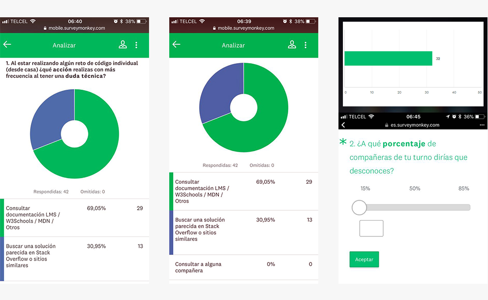

# < Co-Lab >
## Social Network

**Introducción**

Como parte de la currícula de @Laboratoria, se requiere el Producto final del Sprint 3. En el cual las alumnas generan una Red social, haciendo uso de herramientas como JavaScript, HTML, CSS, JQuery, manejo de Data, User Experience, Interface Design y una breve introducción a Firebase. Herramientas revisadas hasta el momento durante el bootcamp.

**De manera puntual los requerimientos son:**

  -	Contar con perfiles de usuarios
  -	Un newsfeed donde ver las actualizaciones los contactos
  -	Dónde poder escribir posts
  -	Poder subir fotos
  -	Capacidad para poder agregar amigos /marcas dentro de la red social
  -	Ser mobile friendly
  -	UX research

## Planificación
Con base en los requerimientos especificados, el equipo procedió a detectar una problemática que pudiera ser resuelta por medio de una red social. Para ello se partió de las siguientes hipótesis:
1. “Hay una falta de integración entre alumnas de Laboratoria”
2. “La resolución de problemas y retos de código de Laboratoria puede ser educativa al hacerse en equipo”
3. “Las alumnas y exalumnas estarían interesadas en participar de una red social que ayude a resolver dudas y fortalecer la comunidad”

Con la finalidad de validar dichas hipótesis y conocer la opinión de las potenciales usuarias, se elaboró un cuestionario de 5 preguntas en Survey Monkey: https://es.surveymonkey.com/r/KFN6RKZ

Obtuvimos un total de 46 respuestas, y gráficamente podemos ver los siguientes resultados:

Realizando un análisis de los datos recabados, se pudo llegar a las siguientes conclusiones que guiaron las decisiones para la elaboración de esta red social:

Posteriormente se desglosaron las actividades principales a modo de pseudocódigo y checklists, y ayudadas por un tablero de Trello, pudimos corroborar nuestros avances.
https://trello.com/b/45wLgRqk/producto-final

## Definición del diseño
Una vez determinados los puntos que requieren las usuarias de nuestra nueva red social, se realizaron bocetos sobre la interacción y aspecto que en ina primera iteración, debía tener.

Se determinó el nombre “Co-Lab” el cual ha sido del agrado de las alumnas. Se realiza una primera etapa de maquetación donde se ha organizado la información de la siguiente manera

## Diseño mobile friendly
En la versión móvil, encontramos una distribución jerárquica donde lo principal es el perfil de la persona, seguido de un espacio para realizar un propio post, el newsfeed donde se pueden consultar posts de personas en la red y al final un buscador de usuarias, con la posibilidad de ver sus datos e invitar a formar parte de tu red.

•	Opcional, si se desarrolla un login o se desea almacenar la información en una base de datos, usar Firebase.
